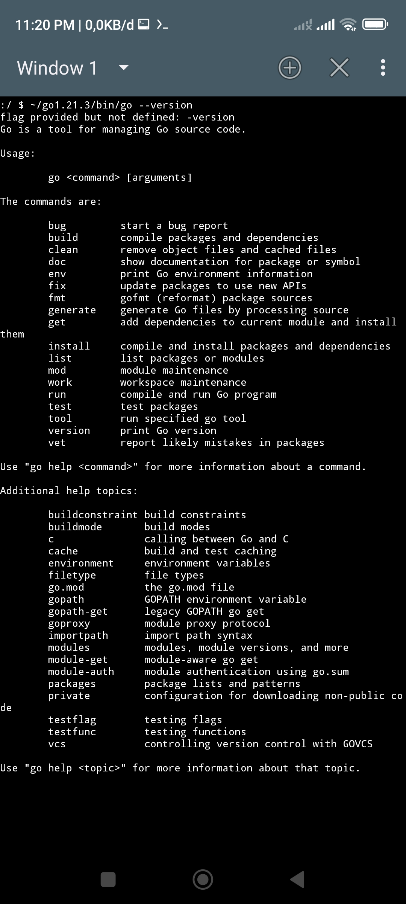

# Golang1.21.3
go1.21.3 for Android Armv8 (aarch64), This was taken from the termux installation. 

Go tarfile https://drive.google.com/file/d/16zu2zh9UZxfjB1ax2kHRirHQRc9I76pG/view?usp=drivesdk

## Tutorial
1. Download Source
2. Unpack
3. Grant permission
   ```
   chmod 755 ~/go1.21.3/bin/go
   ```
4. Test execution with
   ```
   ~/go1.21.3/bin/go --version
   ```
5. Next, you just have to adjust/configure the Go environment according to your wishes.

## Result Terminal Emulator JackPal
The results of the experiment, this can run in the Terminal Emulator

